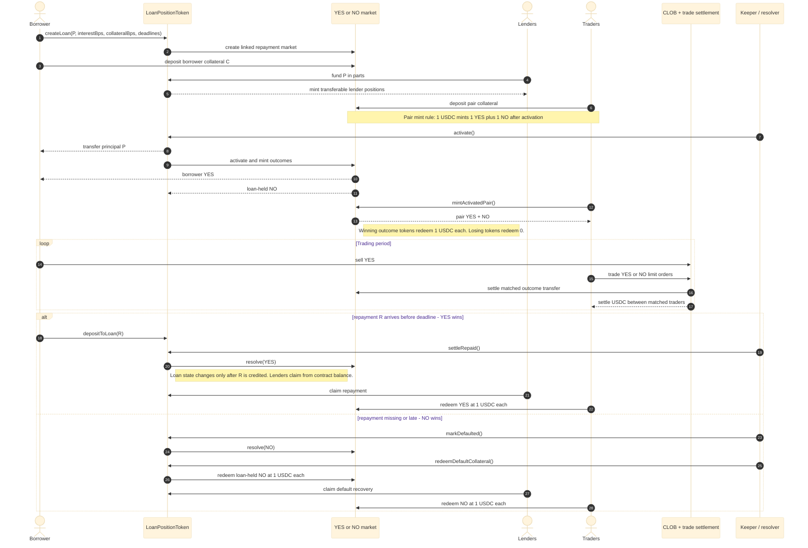
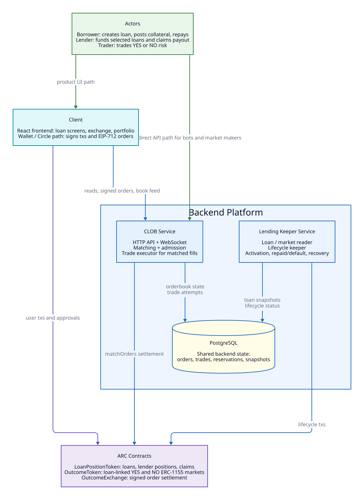

# StopDown Loans Mid-Submission

StopDown Loans is an MVP for prediction-backed lending on ARC. Each loan creates a linked YES/NO
repayment market: lenders fund the loan, the borrower posts outcome collateral, and traders can
price repayment risk through signed CLOB orders settled on-chain.

## What Works Now

- `LoanPositionToken` creates loans, lender positions, funding, activation, repayment/default
  state transitions, proportional claims, and position splits.
- `OutcomeToken` creates loan-linked proto-markets, tracks borrower collateral, mints YES/NO
  outcomes after activation, merges active pairs, and redeems resolved outcomes.
- `OutcomeExchange` settles signed YES/NO limit orders against USDC on-chain.
- TypeScript CLOB backend supports order admission, reservations, matching, retry accounting,
  trade persistence, reconciliation, and WebSocket book updates.
- React frontend has separate screens for overview, loan creation, loan participation, exchange,
  and portfolio/account actions.
- Demo API can run without live deployment for UI review, using fixture-backed responses.
- ARC testnet deployment evidence includes one active demo loan and one direct on-chain YES trade
  recorded in `docs/arc-testnet-deployment.md`.

## Product Flow



Concrete example:

- Borrower requests `$1,000`.
- Borrower chooses `5%` interest and `100%` collateral ratio.
- Required repayment is `$1,050`.
- Borrower commits `$1,000` as loan-linked collateral because `collateralBps = 10,000` is applied to principal.
- Lenders fund `$1,000` and receive transferable lender positions.
- Traders trade YES/NO shares on whether the `$1,050` repayment will arrive before the deadline.
- Any pair minter can deposit `$1` and later mint `1 YES + 1 NO`.
- When the loan starts, the borrower receives transferable YES shares and can sell them to traders.
- Selling YES lets the borrower recover part of the posted collateral value, while YES buyers take repayment/default exposure.
- If repayment arrives on time, YES wins and each YES redeems `$1`; NO redeems `$0`.
- If repayment is missing or late, NO wins and each NO redeems `$1`; YES redeems `$0`.

## Architecture Snapshot



## Demo Path

There are three demo modes. They are intentionally separate because the no-wallet UI demo is
fixture-backed, while protocol behavior is verified through contracts/scripts or ARC deployment.

| Mode | Purpose | State changes? | Command path |
| --- | --- | --- | --- |
| UI demo | Inspect product screens without a wallet or live deployment. | UI-only. Fixture-backed responses, no persisted protocol state. | `demo:api` + `demo:frontend` |
| Local protocol demo | Verify lending, outcome, and exchange behavior against Hardhat. | Yes, inside local Hardhat execution. | `demo:local:repaid`, `demo:local:default`, `test` |
| Local CLOB persistence demo | Verify matching plus backend persistence/reconciliation. | Yes, inside Hardhat plus PostgreSQL. | `db:up`, `db:migrate`, `demo:local:clob-trade`, `test:e2e:local` |
| ARC testnet path | Production-like deployed flow on ARC. | Yes, on ARC testnet. | `deploy:arc-testnet`, ARC scripts, `arc:postdeploy-check` |

Recommended local UI reviewer path:

```powershell
corepack npm ci
npm.cmd run build:frontend
npm.cmd run typecheck:backend
npm.cmd run test:backend
npm.cmd run demo:api
npm.cmd run demo:frontend
```

Read-only UI mode:

```powershell
npm.cmd run demo:api
npm.cmd run demo:frontend
```

`demo:frontend` loads `frontend/.env.demo`, so the frontend contract addresses match the demo API
without relying on local ignored `.env` files. It uses the normal frontend entrypoint and does not
install a wallet provider.

Open:

```text
http://127.0.0.1:5173
```

The demo frontend exposes screens for:

1. borrower creates a loan request;
2. lender reviews and funds a selected loan;
3. borrower collateral and loan activation controls;
4. a loan-linked YES/NO exchange screen;
5. wallet portfolio surfaces for positions, reservations, claims, and balances.

The demo API uses fixture-backed reads and does not persist real protocol or orderbook state. Wallet
actions require an injected EVM wallet or configured Circle Wallet credentials. Production-like ARC
testing uses deployed contracts plus one of those real wallet paths.

Contract and backend verification:

```powershell
npm.cmd run build
npm.cmd test
npm.cmd run test:e2e:local
```

If Hardhat compiler cache access fails inside a restricted sandbox, run those Hardhat commands from
the host shell.

Stateful local protocol walkthroughs:

```powershell
npm.cmd run demo:local:repaid
npm.cmd run demo:local:default
```

Stateful CLOB persistence walkthrough, when PostgreSQL is available:

```powershell
npm.cmd run db:up
npm.cmd run db:migrate
npm.cmd run demo:local:clob-trade
```

Last verified local database smoke status: `npm.cmd run smoke:backend:local` passes against Docker
PostgreSQL on `localhost:55432`, including migrations, DB connectivity, HTTP reads, best bid/ask,
book reads, and WebSocket subscription.

## ARC And Circle Fit

- ARC is the target settlement chain. The contracts are Solidity/EVM-compatible and the project
  includes ARC testnet deployment and verification scripts. Current deployed addresses are recorded
  in `docs/arc-testnet-deployment.md`.
- ARC USDC is treated as the collateral, funding, repayment, and settlement asset.
- The frontend supports injected EVM wallets and Circle User-Controlled Wallet Social Login through
  one provider boundary; see `docs/wallet-path.md`.
- Circle creates an ARC Testnet EOA and executes user-approved contract and EIP-712 signing
  challenges without exposing private keys to StopDown.
- Circle is intentionally scoped as a wallet/gas UX layer, not as CLOB core infrastructure. The
  signed order format and backend matching flow stay wallet-agnostic.
- Power users and market makers are not forced into Circle Wallets. Any EIP-712-capable wallet or
  bot signer can submit signed orders, because the backend matching engine is wallet-agnostic.
- ARC App Kit provides an estimate-first USDC funding command outside the matching core; deeper
  retail kit usage remains optional.
- The read-only demo does not provide transaction or signature simulation.

## ARC Testnet Evidence

Current principal-based contracts:

| Contract | Address |
| --- | --- |
| `LoanPositionToken` | `0x2a26829b172243b7d108f4bfcdea6d221179e0e7` |
| `OutcomeToken` | `0xf5d790f3caed7933c34a24f75582c3d15994e1ec` |
| `OutcomeExchange` | `0x50ae818b42e6c82693cee5fae27ade7f5d4de43b` |
| ARC USDC | `0x3600000000000000000000000000000000000000` |

The current deployment passed wiring and runtime bytecode verification. The transactions below are
historical walkthrough evidence from the previous deployment and must not be mixed with these
current addresses.

Historical demo loan:

- `LOAN_ID=3`
- `MARKET_ID=0x1489a4e8bf6c349a62c1892e03c1206051f11bac3bdf1adaba8aaa6800322ea1`
- Principal: `1 USDC`
- Historical deployment values: required repayment and borrower collateral were both `1.05 USDC`
  under the previous repayment-based collateral formula.
- State after walkthrough: `Active`

Recorded ARC transactions:

| Step | Transaction |
| --- | --- |
| Create loan | `0x20ee75626f7d0b36eae19c0ccd1e4876f76459f0c25d338b01b7edef0b1aee25` |
| Deposit borrower collateral | `0xd58afa4f343d4390bf1be5ac2de8b5bd3f088db663468e90429e8380e9ffd17e` |
| Fund loan | `0x8714023addb75b33efa59e8c870f2e0b170e8667497327b531d09d9ceddb28a6` |
| Activate loan and market | `0x98dec90ed4d25cec4a6b2ab633a7720852579083df2db04fa3eef820a2be3a6f` |
| Backend CLOB settlement tx for `trade_id=1` | `0x532c31c774c0cd96b1c5aa0e5f3f606a26631dd60f28b2cd625dbf83f3d1f15c` |

The recorded demo loan was intentionally left unrepaid/unresolved in the walkthrough, so reviewers
can inspect the active loan-linked market while the ARC testnet state remains available. The backend
CLOB path admitted signed maker/taker orders, matched them, submitted settlement, and reconciled
`trade_id=1` as `CONFIRMED` on a clean reviewer database.

## Placeholders

See `docs/known-limitations.md` for the full cleanup list.

- Circle User-Controlled Wallet frontend integration.
- Circle gas UX integration after ARC/account support is verified.
- ARC onboarding/kit integration for chain setup and funding UX.
- Production oracle and repayment wallet monitoring.
- Production keeper/operator deployment and monitoring.
- Market maker onboarding and liquidity incentives.
- Admin/auth surface for market config writes.
- Full production auth, rate limiting, and abuse controls for the backend.
- Security audit, governance, upgradeability, and production incident controls.
- Polished frontend onboarding and real wallet demo recording.
- Browser UI execution of the live ARC trade path; direct on-chain and backend CLOB settlement have
  been verified through scripts.

## Safety Notes

- `.env`, `frontend/.env`, build outputs, caches, logs, and `node_modules` are ignored.
- Runtime and task-specific templates contain empty private key fields only; real `.env` files are
  ignored.
- Demo/test hashes and addresses are dummy values.
- The backend never stores user private keys.

## Repository Publication

Before publishing:

```powershell
git status --short --ignored
git add --dry-run .
git add .
git commit -m "Initial StopDown Loans MVP"
git branch -M main
git remote add origin https://github.com/<your-user>/<your-repo>.git
git push -u origin main
```

If the remote already exists:

```powershell
git remote set-url origin https://github.com/<your-user>/<your-repo>.git
git push -u origin main
```
