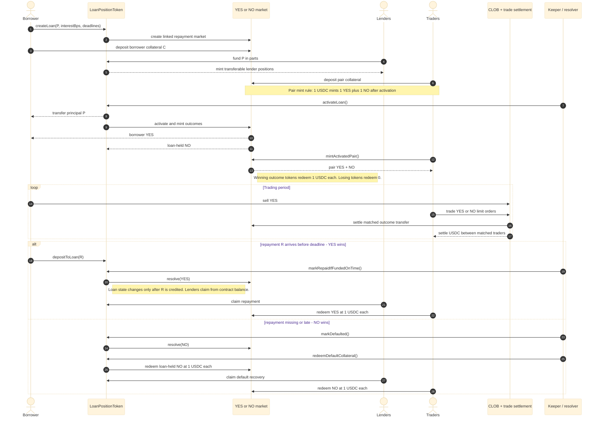

# StopDown Loans Mid-Submission

StopDown Loans is an MVP for prediction-backed lending on ARC. Each loan creates a linked YES/NO
repayment market: lenders fund the loan, the borrower posts outcome collateral, and traders can
price repayment risk through signed CLOB orders settled on-chain.

## What Works Now

- `LoanPositionToken` creates loans, lender positions, funding, activation, repayment/default
  state transitions, proportional claims, and position splits.
- `OutcomeToken` creates loan-linked proto-markets, tracks borrower collateral, mints YES/NO
  outcomes after activation, merges active pairs, and redeems resolved outcomes.
- `OutcomeExchange` settles signed YES/NO limit orders against USDC on-chain.
- TypeScript CLOB backend supports order admission, reservations, matching, retry accounting,
  trade persistence, reconciliation, and WebSocket book updates.
- React frontend has separate screens for overview, loan creation, loan participation, exchange,
  and portfolio/account actions.
- Demo API can run without live deployment for UI review, using fixture-backed reads and mock
  responses.
- ARC testnet deployment evidence includes one active demo loan and one direct on-chain YES trade
  recorded in `docs/arc-testnet-deployment.md`.

## Product Flow



Concrete example:

- Borrower requests `$1,000`.
- Required repayment is `$1,050`.
- Borrower commits `$1,050` as loan-linked collateral.
- Lenders fund `$1,000` and receive transferable lender positions.
- Traders trade YES/NO shares on whether the `$1,050` repayment will arrive before the deadline.
- Any pair minter can deposit `$1` and later mint `1 YES + 1 NO`.
- When the loan starts, the borrower receives transferable YES shares and can sell them to traders.
- Selling YES lets the borrower recover part of the posted collateral value, while YES buyers take repayment/default exposure.
- If repayment arrives on time, YES wins and each YES redeems `$1`; NO redeems `$0`.
- If repayment is missing or late, NO wins and each NO redeems `$1`; YES redeems `$0`.

## Architecture Snapshot


## Demo Path

There are three demo modes. They are intentionally separate because the no-wallet UI demo is
fixture-backed, while protocol behavior is verified through contracts/scripts or ARC deployment.

| Mode | Purpose | State changes? | Command path |
| --- | --- | --- | --- |
| UI demo | Inspect product screens without a wallet or live deployment. | UI-only. Fixture-backed reads, mock responses, no persisted protocol state. | `demo:api` + `demo:frontend` |
| Local protocol demo | Verify lending, outcome, and exchange behavior against Hardhat. | Yes, inside local Hardhat execution. | `demo:local:repaid`, `demo:local:default`, `test` |
| Local CLOB persistence demo | Verify matching plus backend persistence/reconciliation. | Yes, inside Hardhat plus PostgreSQL. | `db:up`, `db:migrate`, `demo:local:clob-trade`, `test:e2e:local` |
| ARC testnet path | Production-like deployed flow on ARC. | Yes, on ARC testnet. | `deploy:arc-testnet`, ARC scripts, `arc:postdeploy-check` |

Recommended local UI reviewer path:

```powershell
npm.cmd install
npm.cmd run build:frontend
npm.cmd run typecheck:backend
npm.cmd run test:backend
npm.cmd run demo:api
npm.cmd run demo:frontend
```

No-wallet UI mode:

```powershell
npm.cmd run demo:api
npm.cmd run demo:frontend
```

`demo:frontend` loads `frontend/.env.demo`, so the frontend contract addresses match the demo API
and the mock signer is enabled without relying on local ignored `.env` files.

Open:

```text
http://127.0.0.1:5173
```

The demo frontend exposes screens for:

1. borrower creates a loan request;
2. lender reviews and funds a selected loan;
3. borrower collateral and loan activation controls;
4. a loan-linked YES/NO exchange screen;
5. wallet portfolio surfaces for positions, reservations, claims, and balances.

Mock signer note: all mocks are registered in `mocks/README.md`. The mock signer is off by default
and is only for local UI testing when a reviewer does not have an injected EVM wallet available.
Mock transactions return demo hashes, and mock order submissions can emit WebSocket updates. The
demo API still uses fixture-backed reads and does not persist real protocol or orderbook state.
Production-like ARC testing should use deployed contracts plus a real wallet.

Contract and backend verification:

```powershell
npm.cmd run build
npm.cmd test
npm.cmd run test:e2e:local
```

If Hardhat compiler cache access fails inside a restricted sandbox, run those Hardhat commands from
the host shell.

Stateful local protocol walkthroughs:

```powershell
npm.cmd run demo:local:repaid
npm.cmd run demo:local:default
```

Stateful CLOB persistence walkthrough, when PostgreSQL is available:

```powershell
npm.cmd run db:up
npm.cmd run db:migrate
npm.cmd run demo:local:clob-trade
```

Last verified local database smoke status: `npm.cmd run smoke:backend:local` passes against Docker
PostgreSQL on `localhost:55432`, including migrations, DB connectivity, HTTP reads, best bid/ask,
book reads, and WebSocket subscription.

## ARC And Circle Fit

- ARC is the target settlement chain. The contracts are Solidity/EVM-compatible and the project
  includes ARC testnet deployment and verification scripts. Current deployed addresses are recorded
  in `docs/arc-testnet-deployment.md`.
- ARC USDC is treated as the collateral, funding, repayment, and settlement asset.
- The currently implemented frontend wallet path is injected EVM provider plus `eth_sendTransaction` and
  `eth_signTypedData_v4`; see `docs/wallet-path.md`.
- Circle User-Controlled Wallets are the planned recommended wallet path for retail borrowers,
  lenders, and traders. This keeps private keys outside the StopDown backend while still allowing
  embedded wallet UX.
- Circle is intentionally scoped as a wallet/gas UX layer, not as CLOB core infrastructure. The
  signed order format and backend matching flow stay wallet-agnostic.
- Power users and market makers are not forced into Circle Wallets. Any EIP-712-capable wallet or
  bot signer can submit signed orders, because the backend matching engine is wallet-agnostic.
- ARC kits remain a planned integration layer around the frontend/onboarding and deployment
  experience. The current MVP already uses ARC as the settlement chain; deeper kit usage should be
  added where it reduces product friction rather than inside the matching core.
- The local mock signer is not a custody model. It is a public demo key for UI checks only.

## ARC Testnet Evidence

Live contracts:

| Contract | Address |
| --- | --- |
| `LoanPositionToken` | `0x7e1a9611f61a40fac7e2f18831a13edf9e8d25e6` |
| `OutcomeToken` | `0xfb5d4095bc502bd0774d8e4437b94573fd29028c` |
| `OutcomeExchange` | `0x45333a5b06a95a2a84cea9ab67f486558943c626` |
| ARC USDC | `0x3600000000000000000000000000000000000000` |

Demo loan:

- `LOAN_ID=1`
- `MARKET_ID=0xc3851385000c2d86f34b031cfa5e672e6651cce7d7af2fc3e0c9b3365fda5427`
- Principal: `1 USDC`
- Required repayment and borrower collateral: `1.05 USDC`
- State after walkthrough: `Active`

Recorded ARC transactions:

| Step | Transaction |
| --- | --- |
| Create loan | `0xe34f44bb2a6f42895f2d5d1a8308c9d8ba3c04988e42c349c434b62ae3618930` |
| Deposit borrower collateral | `0xa13db8e54f22f8b23f7cdac4b817259e106d531549fcc51d1641d573c9f8e6e4` |
| Fund loan | `0xe88c06dc5d28300eb85f525a763e79f552479c8e14f1043c200808ae5a469c42` |
| Activate loan and market | `0x66a7137e344411332ae4a80c41e0120f1f52c3567a5725375de2572fe069a308` |
| Sell `0.2 YES` through `OutcomeExchange` | `0x4fe309716988dd0f30857683f0661c2d4698bcdc7c0789d375d99cf6a4499551` |

The recorded demo loan was intentionally left unrepaid/unresolved in the walkthrough, so reviewers
can inspect the active loan-linked market while the ARC testnet state remains available.

## Placeholders

See `docs/known-limitations.md` for the full cleanup list.

- Circle User-Controlled Wallet frontend integration.
- Circle gas UX integration after ARC/account support is verified.
- ARC onboarding/kit integration for chain setup and funding UX.
- Production oracle and repayment wallet monitoring.
- Production keeper/operator deployment and monitoring.
- Market maker onboarding and liquidity incentives.
- Admin/auth surface for market config writes.
- Full production auth, rate limiting, and abuse controls for the backend.
- Security audit, governance, upgradeability, and production incident controls.
- Polished frontend onboarding and real wallet demo recording.
- Browser UI execution of the live ARC trade path; direct on-chain settlement has been verified.

## Safety Notes

- `.env`, `frontend/.env`, build outputs, caches, logs, and `node_modules` are ignored.
- `.env.example` contains empty private key fields only.
- Demo/test hashes and addresses are dummy values.
- The backend never stores user private keys.

## Repository Publication

Before publishing:

```powershell
git status --short --ignored
git add --dry-run .
git add .
git commit -m "Initial StopDown Loans MVP"
git branch -M main
git remote add origin https://github.com/<your-user>/<your-repo>.git
git push -u origin main
```

If the remote already exists:

```powershell
git remote set-url origin https://github.com/<your-user>/<your-repo>.git
git push -u origin main
```
